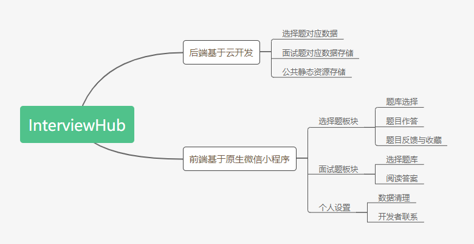

### InterviewHub
#### 一、InterviewHub介绍

##### 1.1 概要介绍
​	这是一个收录互联网行业开发岗方向常见面试题目的工具类小程序，希望能帮助到开发者提高面试技巧，提高技术能力，从而寻找到心仪的工作。目前题库正在不断完善中。

##### 1.2、目标用户

​	本程序面向计算机相关专业或其他想从事互联网开发相关工作的人员。

##### 1.3、应用场景

​	本小程序作用于帮助开发者掌握面试笔试相关的开发知识，从而应对相关的面试笔试，找到心仪的工作。

#### 二、实现思路与架构

##### 2.1 思路架构图



#### 三、作品实现

##### 3.1 作品部分截图


##### 3.2 部分功能代码演示

###### 3.2.1 题库选择与加载

```js
 radioChange: function (e) {
        // console.log(e)
        let current = this.data.radioItems.filter((item) => {
            return item.value === e.detail.value
        })

        wx.showModal({
            title: "确认修改",
            content: `确定选择${current[0].name}吗?`,
            cancelColor: '#707070',
            success: (res) => {
                // 设置新存储情况
                if (res.confirm) {
                    wx.setStorageSync('collection', current[0].value)
                    wx.navigateBack()
                }
                else if (res.cancel) {
                    this.data.radioItems.forEach(item=>{
                        item.checked = false
                    })
                    this.setData({
                        radioItems:this.data.radioItems
                    })
                }
            }

        })
 chooseTiku(e) {
    // console.log(e.currentTarget.dataset.value)
    // 获取参数（下标）
    let currentClick = e.currentTarget.dataset.value;
    let name = e.currentTarget.dataset.name;
    // 显示是否确定
    wx.showModal({
      title: '提示',
      content: `确定是否选择${name}?`,
      success: (res) => {
        if (res.confirm) {
          // this.data.
          this.setData({
            currentTiku: this.data.tiku[currentClick].collection
          }, () => {
            wx.setStorageSync('face_collection', this.data.tiku[currentClick].collection)
            this.updateCurrent()
          })

        } else if (res.cancel) {
          return;
        }
      }
    })

 onLoad: async function (options) {
     	const db = wx.cloud.database();
		const _ = db.command;
        // loading start 
        wx.showLoading({
            title: '加载中',
        })
        // 从数据库读取当前可用题库并设置
        let res = await db.collection("choose").get();
        // console.log(res.data)
        let temp = res.data.map((item, index) => {
            return {
                _id: item._id,
                name: item.name,
                value: item.collection,
            }
        })
        // 获取当前本地缓存数据
        let current = wx.getStorageSync("collection");
        // 设置数据
        this.setData({
            radioItems: temp,
            currentCollection: current
        }, () => {
            wx.hideLoading({
                complete: (res) => { },
            });
        })
    },
        
```

###### 3.2.2 部分内容调用了weui

```json
{
  "usingComponents": {
    "icon-self":"../../components/icon-self/icon-self",
    "mp-dialog":"weui-miniprogram/dialog/dialog"
  },
  "navigationBarTitleText": "选择题"
}
```

##### 3.2.3 "我的"页面授权与登录态检测

```js
    data: {
        isLogin: false,
        avatar: "",
        nickname: ""
    },
    getUserInfo(e) {
        // 设置授权信息
        this.setData({
            avatar: e.detail.userInfo.avatarUrl,
            nickname: e.detail.userInfo.nickName,
            isLogin: true
        });
    },
    clearStorage() {
        // 清除缓存
        wx.showModal({
            title: '提示',
            content: '确定要清除数据吗？',
            success(res) {
                if (res.confirm) {
                    wx.showLoading({
                        title: '清除中',
                    })
                    wx.clearStorageSync();
                    wx.hideLoading({
                        success: (res) => { },
                    })
                }
            }
        })

    },
    /**
     * 生命周期函数--监听页面加载
     */
    onLoad: async function (options) {
        // 登录态判断
        wx.getUserInfo({
            complete: (res) => {
                // console.log(res);
                if (res.userInfo != undefined) {
                    this.setData({
                        avatar: res.userInfo.avatarUrl,
                        nickname: res.userInfo.nickName,
                        isLogin: true
                    });
                }
            },
        })
    },
```

###### 3.2.4 “面试”板块 题目切换设置

```js
changeShow() {
        this.setData({
            showAns: !this.data.showAns
        })
    },
    nextTick() {
        let length = this.data.current.pages.length;
        let idx = this.data.idx;
        if (idx < length - 1) {
            idx++
            this.setData({
                idx,
                showAns: true
            })
        } else {
            this.setData({
                error: "已经是最后一个了!"
            })
        }

    },
    prevTick() {
        let idx = this.data.idx;
        if (idx > 0) {
            idx--
            this.setData({
                idx,
                showAns: false
            })
        } else {
            this.setData({
                error: "已经是第一个了!"
            })
        }
    },
```

#### 四、预览与使用

##### 4.1 体验版二维码


##### 4.2 云开发数据集合

在源代码根目录data文件夹下


#### 五、相关开源协议

本项目遵守MIT开源协议


#### 六、 开发者

WHUT-XGP Github个人主页：https://github.com/WHUT-XGP

khannb Github个人主页： https://github.com/khannb

